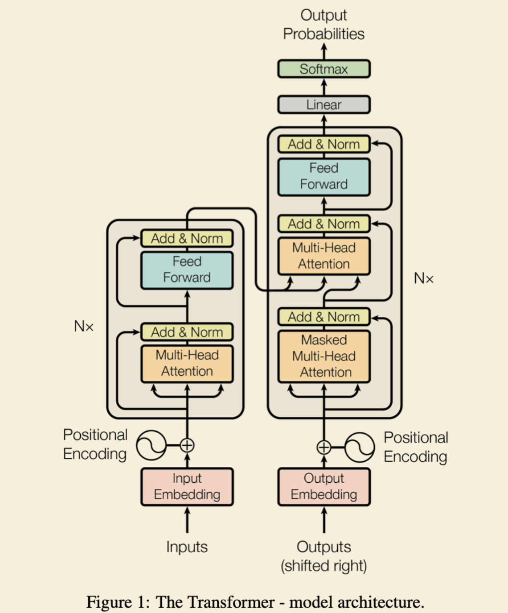

# READEME
论文阅读以及代码实现

## [Attention is all you need](./paper/Attention%20Is%20All%20You%20Need.pdf)
### Why Self-Attention
1. RNN无法并行计算  

    This inherently sequential nature precludes parallelization within training examples, which becomes critical at longer sequence lengths, as memory constraints limit batching across examples.

2. CNN模型无法快速获取两个postion之间的关系  

    In these models, the number of operations required to relate signals from two arbitrary input or output positions grows in the distance between positions, linearly for ConvS2S and logarithmically for ByteNet. This makes it more difficult to learn dependencies between distant positions [12].

3. why self-attention

    One is the total computational complexity per layer. Another is the amount of computation that can be parallelized, as measured by the minimum number of sequential operations required.    
    The third is the path length between long-range dependencies in the network. Learning long-range dependencies is a key challenge in many sequence transduction tasks. One key factor affecting the ability to learn such dependencies is the length of the paths forward and backward signals have to traverse in the network. The shorter these paths between any combination of positions in the input and output sequences, the easier it is to learn long-range dependencies [12]. Hence we also compare the maximum path length between any two input and output positions in networks composed of the different layer types

    一个是每层的总计算复杂度。另一个是可以并行化的计算量，通过所需的最小顺序操作数来衡量。第三个是网络中长程依赖之间的路径长度。学习长程依赖是许多序列转导任务中的一个关键挑战。影响学习这种依赖关系能力的一个关键因素是网络中前向和后向信号必须经过的路径长度。输入和输出序列中任何位置组合之间的路径越短，学习长距离依赖关系就越容易[12]。因此，我们还比较了由不同层类型组成的网络中任意两个输入和输出位置之间的最大路径长度

### 模型架构

**Scaled Dot-Product Attention**

$$
Attention(Q, K, V ) = softmax(\frac{QK^T}{\sqrt{d_k}})V
$$

**Multi-Head Attention**

$$
\begin{aligned}
MultiHead(Q, K, V) = Concat(head_1, head_2, \dots, head_k)W^O    
\end{aligned}
$$

